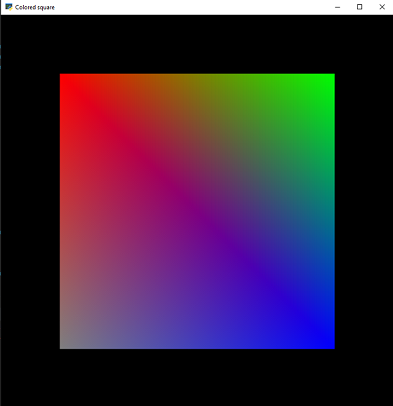
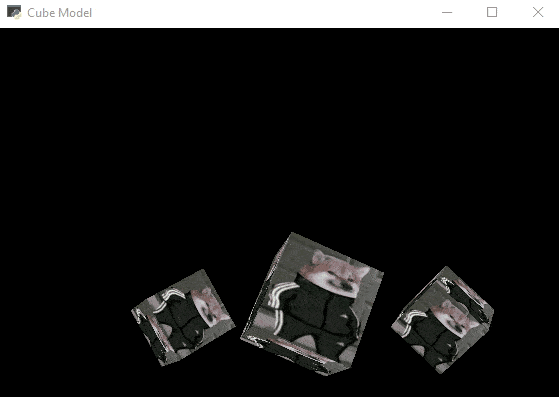

# OpenGL rendering laboratories.   BSU FAMCS 2021 semester #4.

This repository contains 4 labs made by me during OpenGL rendering course.
It contains simple shader implementations and demos using Python 3 and [ModernGL library](https://github.com/moderngl/moderngl).
Implementations of further labs "lay over" the previous ones: starting with a colorful square in Lab1, ending with a lightning model in lab4.

##Lab #1
The task was to implement a program displaying a colorful square seen on the picture. 
It involves basic understanding of shaders logic and a brief introduction into ModernGL.

##Lab #2
The task was to implement a program displaying a rotating cube with some texture put onto. 
It required establishing basic view-model structure for the project and understanding of basic texturing concepts.
I find this dogo picture quite funny and hope so does everyone watching this for whatever reason.

##Lab #3
The task was to implement a moving camera for the scene. 
It required adding some controller-based structure classes and basically getting into the ModernGL documentation deeper.

##Lab #4
The task was to add an imaginary source of light reflecting onto the given shapes.
It required a brief understanding of basic lightning concepts. It's implemented in a simplest way using a rather random pixel color calculation based on a "ambient" coefficient.

##Important note
Have a nice day :)
